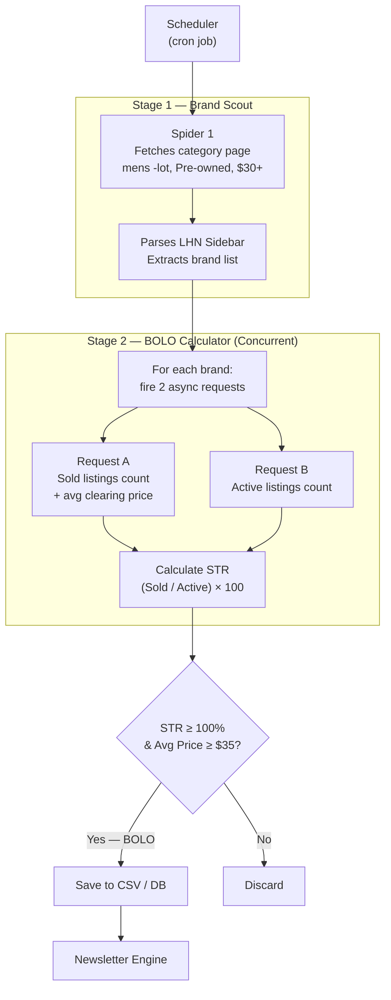

# Menswear BOLO Pipeline

> An automated, asynchronous data pipeline that identifies high-margin, high-velocity men's pre-owned clothing on eBay — powering a proprietary sourcing intelligence newsletter for resellers.

[](https://www.python.org/)
[]()
[]()

---

## Overview

The **Menswear BOLO Pipeline** is a two-stage web scraping and data processing system designed to surface brand-level resale opportunities on eBay. The system programmatically identifies brands where market demand (sell-through) outpaces supply, qualifying them as **BOLOs** (Be On Look Out) — high-priority items for resellers to source.

The output feeds directly into a curated newsletter delivering weekly BOLO signals to an audience of professional resellers.

---

## Key Business Questions

This pipeline is designed to answer high-impact sourcing and market intelligence questions for resellers and e-commerce operators:

| # | Question | Business Relevance |
| :--- | :--- | :--- |
| 1 | **Which brands have demonstrated the strongest and most consistent sell-through rates over the past 90 days?** | Identifies the safest brands to invest in capital — signals sustained demand, not a one-time spike. |
| 2 | **Which categories are trending vs. cooling heading into the next season?** | Helps resellers time sourcing ahead of demand peaks (e.g., stocking flannels in July, swimwear in February). |
| 3 | **Where is the market undersupplied relative to demand?** | STR > 200% flags categories where inventory sells out faster than it's listed — indicating pricing power. |
| 4 | **Which price tiers generate the highest net profit margin?** | Separates volume plays (low price, high volume) from premium plays (high margin, lower competition). |
| 5 | **Are there emerging brands breaking into BOLO territory for the first time?** | Surfaces early movers before competition increases and margins compress. |
| 6 | **Which categories have the most volatile sell-through (high variance week-to-week)?** | Helps resellers assess risk tolerance — consistent BOLOs vs. opportunistic ones. |

**V1 scope (Questions 1–4):** Answered from the first weekly run using a single data snapshot.
**V2 scope (Questions 5–6):** Require at least two weeks of accumulated data to compute week-over-week comparisons.

---


## System Architecture



---

## How It Works

### Stage 1 — Brand Scout (`Spider 1`)
- Navigates to an eBay category URL filtered for **Pre-owned**, **Buy It Now**, **$30+ price**, **Sold listings**
- Parses the eBay Left-Hand Navigation (LHN) sidebar, which lists the most frequently appearing brands
- Outputs a Python list of brand candidates to feed Stage 2

### Stage 2 — BOLO Calculator (`Spider 2`)
For each brand from Stage 1, two concurrent HTTP requests are fired:
- **Request A (Sold):** Scrapes total sold listings in the last 90 days + average clearing price
- **Request B (Active):** Scrapes total currently active listings

The system then calculates the **Sell-Through Rate (STR)** and **Estimated Net Profit:**

```
STR (%) = (Sold in Last 90 Days / Active Listings) × 100

Est. Net Profit = Avg Sold Price - COGS - eBay Fees (13%) - Shipping ($8.99)
```

**eBay fee breakdown:** Final value fee (~12.9%) + payment processing (~0.3%) = ~13% of sale price.

**Default COGS assumption:** `$7.00` — representative of thrift store sourcing, the most common channel for pre-owned resellers. Configurable at runtime via `--cogs` (see Usage).

**Default Shipping assumption:** `$8.99` — based on USPS Ground Advantage rates for mid-weight men's clothing (1–2 lbs) with eBay's negotiated seller discount (~30–45% below retail). This covers the majority of categories (shirts, jeans, pants, sweaters). Heavier items like coats may run $12–14. Configurable via `--shipping`.

| Shipping Method & Item Type | Est. Weight | Typical Cost (w/ eBay discount) |
| :--- | :--- | :--- |
| Ground Advantage — light shirts, tees, polos | 6–10 oz | $5.00–$6.50 |
| Ground Advantage — jeans, pants, shorts, sweaters | 1–2 lbs | **$8.00–$9.50 (default: $8.99)** |
| Ground Advantage — heavy outerwear | 2–4 lbs | $10.00–$12.00 |
| Priority Mail Flat Rate (small box) | Any | $10.20 |
| Priority Mail Flat Rate (medium box) | Any | $15.20–$17.10 |

| Sourcing Channel | Typical COGS |
| :--- | :--- |
| Thrift Store (default) | $7 |
| Flea Market | $5 |
| Yard Sale | $3–5 |
| eBay Sniping | $15–25 |
| Estate Sale | $8–15 |

**Qualification threshold:** STR >= 100% AND Est. Net Profit >= $20 (at default COGS)

> **STR interpretation:** A rate >= 100% means items sell faster than they are listed — a signal of strong, unmet demand. The higher the STR, the stronger the BOLO signal.

---

## BOLO Criteria

| Criterion | Threshold |
| :--- | :--- |
| Item Condition | Pre-owned only |
| Minimum Avg. Sale Price | >= $35 |
| Cost of Goods Sold (COGS) | $7.00 default (thrift store); configurable via `--cogs` flag |
| eBay Platform Fees | ~13% of sale price (final value fee + payment processing) |
| Estimated Shipping Cost | $8.99 default — USPS Ground Advantage, mid-weight clothing (1–2 lbs) with eBay seller discount; configurable via `--shipping` flag |
| Minimum Net Profit | >= $20 after all deductions |
| Sell-Through Rate | >= 100% |

---

## Tech Stack

| Component | Technology |
| :--- | :--- |
| Language | Python 3.10+ |
| Async I/O | `asyncio`, `aiohttp` |
| HTML Parsing | `BeautifulSoup4` |
| Data Processing | `pandas` |
| Rate Limiting | Rotating `User-Agent` headers + `asyncio.sleep()` jitter |
| Output | CSV / SQLite / PostgreSQL |

---

## Output Schema

| Column | Type | Description |
| :--- | :--- | :--- |
| `date_scraped` | Timestamp | When the data was collected |
| `category` | String | e.g., `Casual Button-Down Shirts` |
| `brand` | String | e.g., `Faherty` |
| `active_listings_count` | Integer | Current active competition on eBay |
| `sold_90_days_count` | Integer | Units sold in the last 90 days |
| `sell_through_rate` | Float | `(sold / active) × 100` |
| `avg_sold_price` | Float | Average clearing price ($) |
| `cogs` | Float | Cost of goods sold — default $7, user-configurable |
| `ebay_fees` | Float | Calculated as 13% of `avg_sold_price` |
| `shipping_cost` | Float | Estimated shipping — default $8.99 (USPS Ground Advantage), configurable |
| `estimated_net_profit` | Float | `avg_sold_price - cogs - ebay_fees - shipping_cost` |
| `is_bolo` | Boolean | `True` if STR >= 100% and net profit >= $20 |

### Sample Output

| brand | category | active | sold_90d | str_pct | avg_price | cogs | ebay_fees | shipping | net_profit | is_bolo |
| :--- | :--- | ---: | ---: | ---: | ---: | ---: | ---: | ---: | ---: | :--- |
| Faherty | Casual Button-Down | 28 | 91 | 325% | $74.00 | $7.00 | $9.62 | $8.99 | $48.39 | 1 |
| Billy Reid | Casual Button-Down | 14 | 44 | 314% | $68.50 | $7.00 | $8.91 | $8.99 | $43.60 | 1 |
| Roark | Casual Button-Down | 19 | 48 | 253% | $52.00 | $7.00 | $6.76 | $8.99 | $29.25 | 1 |
| Peter Millar | Casual Button-Down | 42 | 97 | 231% | $61.00 | $7.00 | $7.93 | $8.99 | $37.08 | 1 |
| Bonobos | Casual Button-Down | 65 | 81 | 125% | $38.50 | $7.00 | $5.01 | $8.99 | $17.51 | 0 |

---

## Installation

```bash
# Clone the repository
git clone https://github.com/your-username/menswear_bolo_pipeline.git
cd menswear_bolo_pipeline

# Create and activate a virtual environment
python -m venv venv
source venv/bin/activate  # Windows: venv\Scripts\activate

# Install dependencies
pip install -r requirements.txt
```

---

## Usage

```bash
# Run with default COGS ($7 — thrift store assumption)
python main.py --category "casual-button-down-shirts"

# Override COGS for a different sourcing channel
python main.py --category "t-shirts" --cogs 5     # flea market
python main.py --category "jeans" --cogs 15        # eBay sniping

# Override shipping cost (e.g., heavy jacket via Priority Mail)
python main.py --category "coats" --cogs 12 --shipping 12

# Dry run (scraping only, no profit filtering)
python main.py --category "jeans" --dry-run
```

If `--cogs` is not provided, the pipeline will prompt interactively:

```
Enter your average cost of goods (COGS) per item [default: $7.00]: _
```

---

## Categories Covered

| # | Category | Subcategories |
| --- | --- | --- |
| 1 | **Shirts** | T-Shirts, Casual Button-Down, Polos, Dress Shirts |
| 2 | **Activewear** | Tops, Hoodies & Sweatshirts, Pants, Shorts, Tracksuits, Jackets |
| 3 | Coats, Jackets & Vests | — |
| 4 | Jeans | — |
| 5 | Pants | — |
| 6 | Shorts | — |
| 7 | Sweaters | — |
| 8 | Swimwear | — |

---

## V2 Roadmap

- [ ] Automated newsletter composition and delivery (Resend API)
- [ ] BI dashboard for trend visualization (Tableau / Plotly)
- [ ] Scheduled pipeline execution (cron / Airflow)
- [ ] PostgreSQL persistence layer with historical trend tracking
- [ ] Brand discovery agent for auto-updating the brand watchlist